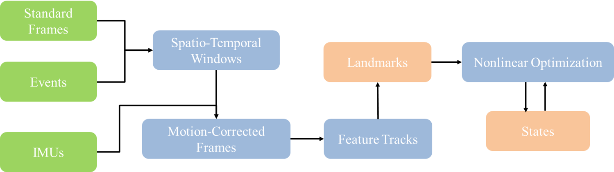

# Hybrid_Sensors_State_Estimation

This project explores a hybrid state estimation framework that fuses data from **event cameras**, **standard cameras**, and **IMUs** to enhance  state estimation accuracy in dynamic and visually degraded environments.



## Installation

System Requirements

- Ubuntu 18.04
- CMake >= 3.0
- ROS Melodic

Dependencies

```bash
sudo apt update
sudo apt install liblapack-dev libblas-dev
```

Build Instructions

Create and configure a catkin workspace:

```bash
mkdir -p ~/uslam_ws/src
cd ~/uslam_ws
catkin init
catkin config --extend /opt/ros/melodic --cmake-args -DCMAKE_BUILD_TYPE=Release
```

Clone this repository:

```bash
cd src
git clone https://github.com/jiamincheng/Hybrid_Sensors_State_Estimation.git
```

Install dependencies using `vcs-import`:

```bash
vcs-import < rpg_ultimate_slam_open/dependencies.yaml
```

Build the workspace:

```bash
cd ~/uslam_ws
catkin build ze_vio_ceres
source devel/setup.bash
```

Run the Demo

```bash
roslaunch ze_vio_ceres ijrr17.launch bag_filename:=dynamic_6dof.bag
```

Replace `dynamic_6dof.bag` with your own rosbag if needed.

## Dataset

- Simulated Data from the [Event Camera Dataset](https://rpg.ifi.uzh.ch/davis_data.html), based on the DAVIS 240 simulator. Includes ground truth pose, event stream, grayscale frames, and IMU data.
- Real-World Data collected with the DAVIS 346 sensor in indoor environments, using hand-held motion and varying lighting conditions.

Evaluation Metrics

- Mean Position Error (MPE)
- Mean Yaw Error (MYE)

### Example Results

[View Demo Video](https://drive.google.com/file/d/1Fty3oI6187ylfvltUHEuMPrDNF01KqCv/view?usp=sharing)