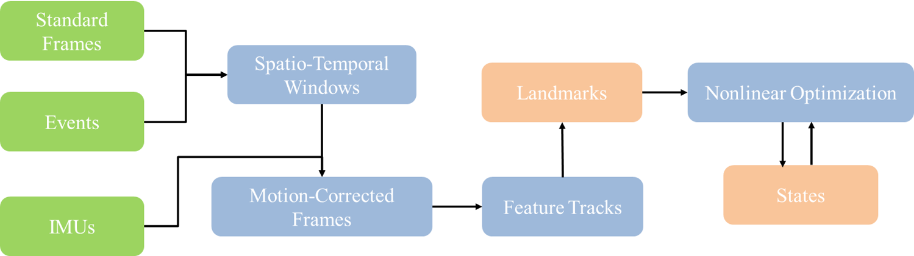

# Hybrid_Sensors_State_Estimation

This project explores a hybrid state estimation framework that fuses data from **event cameras**, **standard frame-based cameras**, and **IMU sensors** to enhance localization accuracy in dynamic and visually degraded environments.



## Installation and Usage

System Requirements

- Ubuntu 18.04
- CMake >= 3.0
- ROS Melodic

Dependencies

```bash
sudo apt update
sudo apt install liblapack-dev libblas-dev
```

Build Instructions

Create and configure a catkin workspace:

```bash
mkdir -p ~/uslam_ws/src
cd ~/uslam_ws
catkin init
catkin config --extend /opt/ros/melodic --cmake-args -DCMAKE_BUILD_TYPE=Release
```

Clone the Ultimate SLAM repository:

```bash
cd src
git clone git@github.com:uzh-rpg/rpg_ultimate_slam_open.git
```

Install dependencies using `vcs-import`:

```bash
vcs-import < rpg_ultimate_slam_open/dependencies.yaml
```

Build the workspace:

```bash
cd ~/uslam_ws
catkin build ze_vio_ceres
source devel/setup.bash
```

Run the Demo

```bash
roslaunch ze_vio_ceres ijrr17.launch bag_filename:=dynamic_6dof.bag
```

Replace `dynamic_6dof.bag` with your own rosbag if needed.